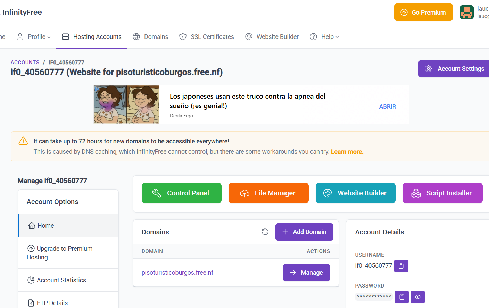

# Manual de Usuario: Despliegue del Proyecto Web para la Gestión de una V.U.T. en InfinityFree
Guía paso a paso para descargar, configurar y subir el proyecto web a un hosting gratuito de InfinityFree.

## 1. Descarga el proyecto
1.1. Descarga este proyecto en tu ordenador.  

1.2. Extrae el contenido en tu ordenador.

## 2. Crear cuenta en Infinityfree
2.1. Entra en: https://infinityfree.net  

2.2. Haz clic en Sign Up.  

2.3. Registra tu correo electrónico y crea una contraseña.

2.4. Confirma la cuenta desde tu email.

2.5. Inicia sesión en el panel de InfinityFree.

## 3. Crear hosting
3.1. En el panel principal, selecciona Create Account.

3.2. Elige un subdominio gratuito (ej.: tuvivienda.epizy.com) o un dominio propio si ya lo tienes.

3.3. Espera a que InfinityFree active la cuenta (1–2 minutos).

3.4. Entra en la cuenta creada para ver la URL del sitio, los datos FTP y el acceso al panel de control (VistaPanel).

## 4. Crear base de datos MySQL

## 5. Configuración config.js

## 6. Configuración config.php

## 7. Configuración galería

## 8. Preparar el proyecto (npm)

npm install
npm install leo-profanity
npm run build
npm run dev

## 9. Subir la carpeta dist a htdocs 

## 10. Subir la carpeta galeria a htdocs 

## 11. Subir los archivos php a htdocs 

## 12. Subir la carpeta vendor a htdocs

## 13. Comprobación final
13.1. Abre tu dominio en el navegador y verifica el correcto funcionamiento.