# Manual de Usuario: Despliegue del Proyecto Web para la Gestión de una V.U.T. en InfinityFree
Guía paso a paso para descargar, configurar y subir el proyecto web a un hosting gratuito de InfinityFree.

## 1. Descarga el proyecto

### 1.1. Obtener el código fuente.
Puedes descargar el proyecto de dos formas:  
- **Descarga directa:**  
Accede al repositorio y selecciona *Code → Download ZIP*:  
https://github.com/lcunado/TFM.git 

- **Clonado del repositorio a través de Git:**  
Ejecuta en tu terminal:    
```git clone https://github.com/lcunado/TFM.git```


### 1.2. Extrae el contenido en tu ordenador.
Si has descargado el archivo *ZIP*, descomprímelo en una carpeta de tu ordenador para poder acceder a todos los archivos del proyecto.


## 2. Crea una cuenta en Infinityfree

### 2.1. Entra en: https://infinityfree.net  

### 2.2. Haz clic en *Sign Up*.  

### 2.3. Registra tu correo electrónico y crea una contraseña.

### 2.4. Confirma la cuenta desde tu email.

### 2.5. Inicia sesión en el panel de *InfinityFree*.

## 3. Crea el *hosting*

### 3.1. En el panel principal, selecciona *Create Account*.


### 3.2. Elige un dominio  
Puede ser uno gratuito con subdominio *nombredetupiso* y extensión por ejemplo *lovestoblog.com* o un dominio propio si ya lo tienes.  
Comprueba la disponibilidad en *Check Availability*. 
 
Y crea la cuenta en *Create Account*.


### 3.3. Espera a que *InfinityFree* active la cuenta (1–2 minutos).


### 3.4. Entra en la cuenta creada.
- **Puedes ver la *URL* del sitio y los datos *FTP* en *Overview*.**

- **Puedes acceder al panel de control en *Control Panel*.**


## 4. Crea la base de datos MySQL

### 4.1. Accede a *Control Panel*.


### 4.2. Accede a *DataBases -> MySQL Databases*.


### 4.3. Crea la base de datos bd_pisoturistico.
Es muy importante que se llame **bd_pisoturistico**.  
Escribe el nombre pulsa en *Create Database*.


### 4.4. Accede a la base de datos creada.
Pulsa sobre el botón *Admin* que se encuentra en *Current Databases*.
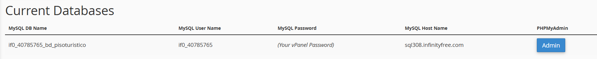

### 4.5. Crea las tablas de la base de datos.

- **Al acceder en la base de datos cargará *php-myAdmin***.
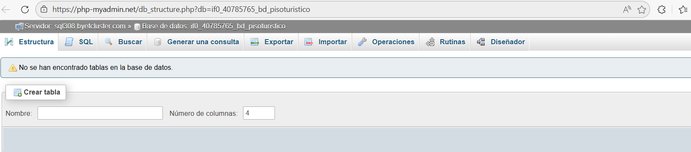
- **Selecciona *SQL* y copia en la consulta, el texto que se encuentra en la carpeta *sql/reservas.sql* del proyecto descargado.**
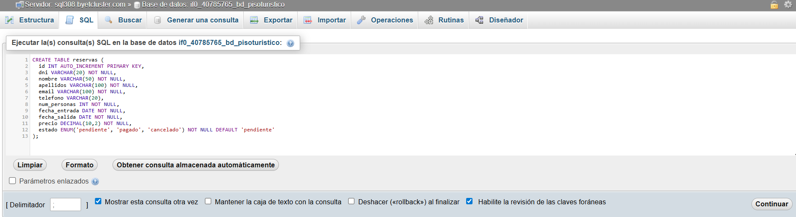
- **Pulsa en botón *Continuar* y aparecerá el mensaje de confirmación de la consulta:**
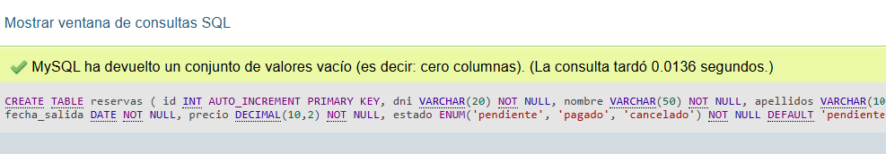
- **Repite el proceso para la tabla de cancelaciones y de valoraciones:**
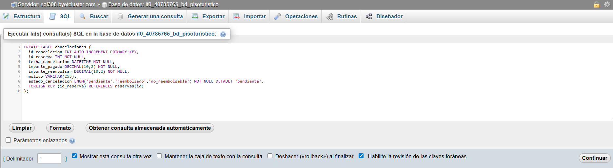

- **Al finalizar deben aparecer las tres tablas en la base de datos:**
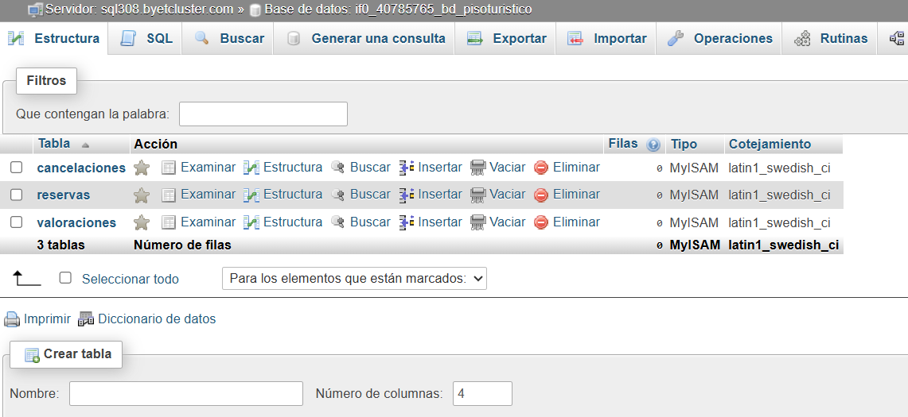

## 5. Configuración *config.js*
El proyecto incluye un archivo de configuración que permite personalizar fácilmente todos los datos del alojamiento sin necesidad de modificar el código interno.  
Este archivo se encuentra en *config/config.js* dentro del proyecto.  
Para adaptar la aplicación a tu propio alojamiento, solo tienes que editar los valores de este objeto, respetando la estructura existente. Por ejemplo:
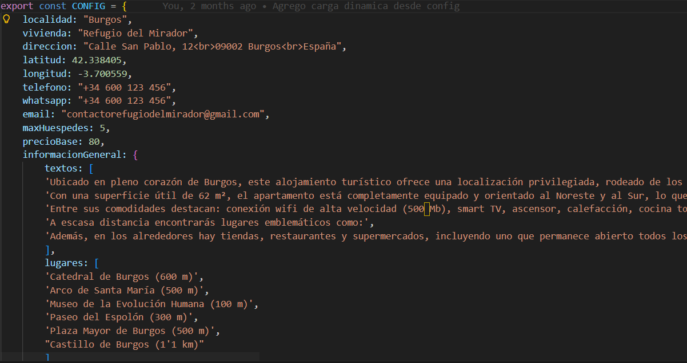
**Qué debes modificar:**
- localidad: ciudad o zona donde se encuentra el alojamiento.
- vivienda: nombre comercial del alojamiento.
- direccion: dirección completa (puede incluir saltos de línea con <br>).
- latitud / longitud: coordenadas para mostrar el mapa correctamente.
- telefono / whatsapp / email: datos de contacto que aparecerán en la web.
- maxHuespedes: número máximo de personas permitidas.
- precioBase: precio por noche utilizado en el cálculo automático.
- informacionGeneral.textos: descripciones del alojamiento. Cada texto separado por comillas simples es un párrafo.
- informacionGeneral.lugares: puntos de interés cercanos.
- iconosIncluidos: iconos y características destacadas.
- politicasReserva: normas, horarios y condiciones de reserva.  

**Importante:**
- No elimines llaves {}, comas , ni corchetes [].
- Solo cambia los textos y números que aparecen entre comillas o después de los dos puntos.
- Si añades nuevos textos o iconos, sigue el mismo formato que los existentes.

## 6. Configuración *config.php*
El proyecto también incluye un archivo de configuración de datos sensibles (precios, información bancaria, conexión a la base de datos...) con los que trabaja el servidor.  
Este archivo se encuentra en *php/config.php* dentro del proyecto.  
**No confundir con *config/config.js***  
Al igual que con el archivo anterior, debes editar los valores de este objeto, respetando la estructura existente.  
Por ejemplo:
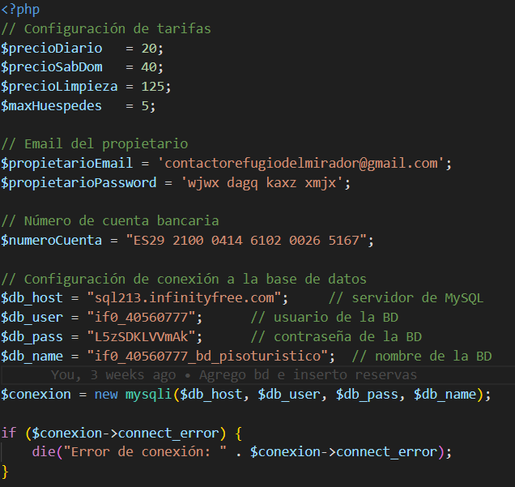
**Qué debes modificar:**
1. Tarifas del alojamiento. Estos valores se utilizan en el cálculo automático del precio final de la reserva:
- $precioDiario: precio por noche de lunes a viernes.
- $precioSabDom: precio por noche en sábado y domingo.
- $precioLimpieza: coste fijo de limpieza.
- $maxHuespedes: número máximo de huéspedes permitidos.
2. Datos del propietario. Estos datos se utilizan para el envío de correos automáticos desde el formulario de contacto y desde el sistema de reservas.
- $propietarioEmail: dirección de correo de gmail donde se recibirán las notificaciones.
- $propietarioPassword: contraseña o clave de aplicación del correo (Gmail App Password).
3. Número de cuenta bancaria
- $numeroCuenta: IBAN donde el cliente debe realizar el pago de la reserva.
4. Conexión a la base de datos. Estos valores deben coincidir con los datos proporcionados por el servicio de *hosting* y se encuentran en *FTP Details* de la cuenta de *InfinityFree*.
- $db_host: servidor MySQL.
- $db_user: usuario de la base de datos.
- $db_pass: contraseña del usuario.
- $db_name: nombre de la base de datos.   

 
**Importante:**
- No elimines líneas ni cambies la estructura del archivo.
- Solo modifica los valores que aparecen entre comillas o después del signo =.
- Si cambias de *hosting*, deberás actualizar los datos de conexión a la base de datos.

## 7. Configuración galería

### 7.1. Subir las fotos
El proyecto incluye una página de galería que muestra las fotografías del alojamiento de forma dinámica.  
Dentro de la carpeta galeria situada en la raiz del proyecto, encontrarás las imágenes de ejemplo incluidas por defecto.  
Para mostrar tus propias fotografías en la web, simplemente debes reemplazar estos archivos por las imágenes reales de tu alojamiento.  
**Importante:**  
Es imprescindible utilizar el  formato WEBP y seguir la numeración dada: 01.webp, 02.webp... 
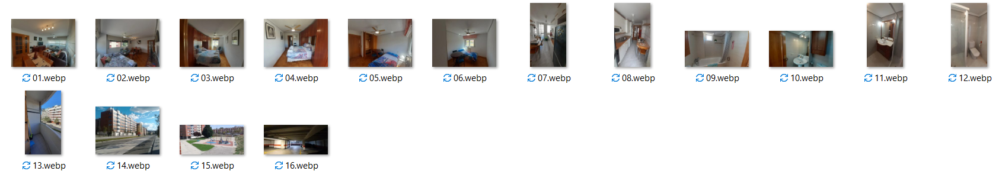

### 7.2. Configuración *galeria.js*
Además de subir las imágenes a la carpeta /galeria, el usuario debe actualizar el archivo encargado de generar la galería en la web.  
Accede al archivo *src/assets/scripts/galeria.js*.
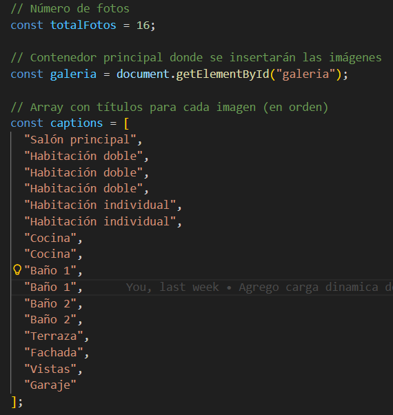  
Este archivo controla cuántas fotos se muestran, el orden en el que aparecen, los títulos de cada imagen y el funcionamiento del visor ampliado.    
**Qué debes modificar:**
1. Número total de fotografías.  
Si subes 10 fotos → const totalFotos = 10;  
Si subes 20 fotos → const totalFotos = 20;
2. Descripciones de cada imagen en *captions*.  
Por ejemplo para 5 fotos:  
const captions = [ "Salón", "Dormitorio", "Cocina", "Baño", "Vistas desde la terraza" ];

## 7.3. Cambia la imagen de bienvenida (opcional)
Dentro de *src/assrts/images* puedes modificar la imagen de fondo de bienvenida de la página princial.  
Debes tener en cuenta que se debe llamar exactamente igual **"fondo.webp"**.

## 8. Preparar el proyecto (npm)
Antes de ejecutar la aplicación en tu entorno local, es necesario instalar las dependencias y generar la versión compilada del proyecto.   
Para ello, abre una terminal en la carpeta raíz del proyecto y comprueba si tienes instalado Node.js con el comando:  
```node -v``` 
  
Si no tienes descargado Node.js debes descargarlo desde la web oficial: https://nodejs.org.  
A continuación, ejecuta los siguientes comandos:  
```npm install```  
  
```npm install leo-profanity```  
  
```npm run build```  
  
Al finalizar habrá creado la carpeta *dist* con el contenido de la página web listo para producción:
 

## 9. Sube la carpeta *dist* al servidor 

### 9.1. Accede a *File Manager*  
En el panel de control de InfinityFree, entra en File Manager para gestionar los archivos del servidor.  
  

### 9.2. Sube el contenido de *dist*
Dentro del administrador de archivos, abre la carpeta *htdocs*. A continuación:
- Elimina los archivos que vienen por defecto en *htdocs*.
- Haz clic en *Upload*.
- Selecciona *Files*.
- Elige todos los archivos y carpetas que contiene tu carpeta *dist*.
- Sube el contenido para reemplazar el sitio por tu versión compilada.
 

## 10. Sube la carpeta galeria al servidor
Además del contenido de la carpeta *dist*, es necesario subir las imágenes del alojamiento para que la galería funcione correctamente. Estas imágenes deben colocarse en la carpeta galeria del servidor.

### 10.1. Accede a *File Manager*
Desde el panel de control de *InfinityFree*, entra en *File Manager* para gestionar los archivos del servidor.

### 10.2. Sube la carpeta galeria
Dentro del administrador de archivos, abre la carpeta *htdocs*. A continuación:
- Haz clic en *Upload*.
- Selecciona *Folder*.
- Elige la carpeta galeria de tu proyecto local y súbela completa al servidor.
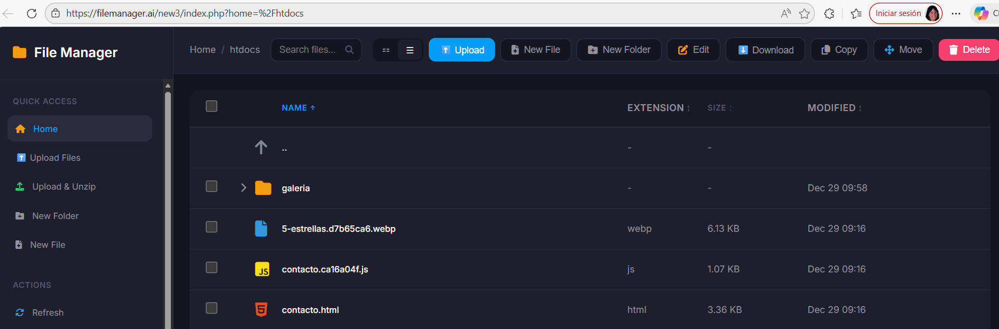 

## 11. Sube los archivos *php* al servidor 

Además de la carpeta *dist* y la carpeta galeria, es necesario subir los archivos *PHP* que gestionan la lógica del sistema (reservas, formularios, conexión a la base de datos, etc.).

### 11.1. Accede a *File Manager*
En el panel de control de *InfinityFree*, entra en *File Manager* para gestionar los archivos del servidor.

### 11.2. Sube el contenido de *php*
Dentro del administrador de archivos, abre la carpeta *htdocs*. A continuación: 
- Selecciona *Files*.
- Elige todos los archivos y carpetas que contiene tu carpeta *php*.

## 12. Sube la carpeta vendor al servidor
Por último, es necesario subir la carpeta vendor para que el envío de correos funcione correctamente. 

### 12.1. Accede a *File Manager*
Desde el panel de control de *InfinityFree*, entra en *File Manager* para gestionar los archivos del servidor.

### 12.2. Sube la carpeta vendor
Dentro del administrador de archivos, abre la carpeta *htdocs*. A continuación:
- Haz clic en *Upload*.
- Selecciona *Folder*.
- Elige la carpeta galeria de tu proyecto local y súbela completa al servidor.

## 13. Comprobación final
Enhorabuena, ya tienes todo listo.  
Para comprobarlo abre tu dominio en el navegador y verifica el correcto funcionamiento:
 

## 14. Mantenimiento de la base de datos
El sistema de reservas almacena toda la información en la base de datos: solicitudes, importes, estados de pago y cancelaciones.  
Para garantizar que los datos estén siempre actualizados, debes realizar un pequeño mantenimiento manual cada vez que se reciba un pago o se emita un reembolso.

### 14.1. Actualizar el estado de una reserva tras recibir un pago
Cuando un cliente realiza el pago de su reserva, debes reflejarlo en la base de datos:
- Accede al panel de control de tu hosting.
- Entra en *phpMyAdmin*.
- Selecciona la base de datos del proyecto.
- Abre la tabla reservas.
- Localiza la reserva correspondiente y selecciona editar.
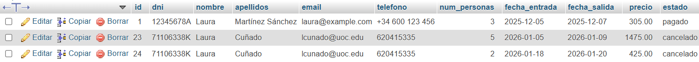 
- Modifica el campo estado y cámbialo a **pagado**, si el cliente ha realizado el pago.
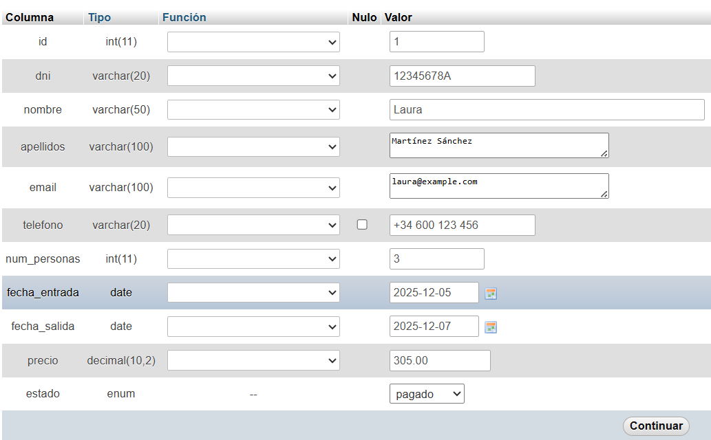 
- Guarda los cambios.

### 14.2. ¿Qué ocurre si el cliente no realiza el pago en 24 horas?
Si el cliente no completa el pago en un plazo máximo de 24 horas, la reserva debe considerarse cancelada.  
En este caso, debes actualizar manualmente la base de datos:
- Accede a *phpMyAdmin*.
- Abre la tabla reservas.
- Localiza la reserva pendiente de pago.
- Cambia el campo estado a **cancelado**.
- Guarda los cambios.  

Esto permite liberar las fechas y evitar que queden bloqueadas por reservas no confirmadas.

### 14.3. Registrar un reembolso
Si devuelves parte o la totalidad del importe de una reserva, debes actualizar la base de datos para mantener un historial claro y coherente.
- Accede a *phpMyAdmin*.
- Selecciona la tabla cancelaciones.
- Localiza la cancelación que has reembolsado.
- Cambia el campo estado a **reembolsado**.  

Este procedimiento permite llevar un control claro de los movimientos económicos y facilita la trazabilidad de cada reserva.