# Manual de Usuario: Despliegue del Proyecto Web para la Gestión de una V.U.T. en InfinityFree
Guía paso a paso para descargar, configurar y subir el proyecto web a un hosting gratuito de InfinityFree.

## 1. Descarga el proyecto

### 1.1. Obtener el código fuente.
Puedes descargar el proyecto de dos formas:  
- **Descarga directa:**  
Accede al repositorio y selecciona *Code → Download ZIP*:  
https://github.com/lcunado/TFM.git  
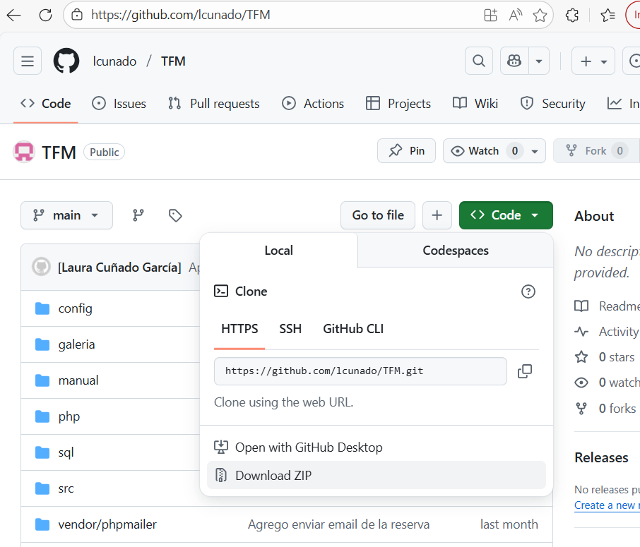

- **Clonado del repositorio a través de Git:**  
Ejecuta en tu terminal:    
```git clone https://github.com/lcunado/TFM.git```  
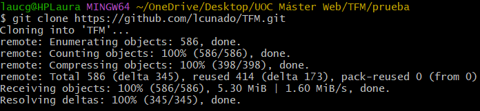 

### 1.2. Extrae el contenido en tu ordenador.
Si has descargado el archivo *ZIP*, descomprímelo en una carpeta de tu ordenador para poder acceder a todos los archivos del proyecto.  
 

## 2. Crea una cuenta en Infinityfree

### 2.1. Entra en: https://infinityfree.net  

### 2.2. Haz clic en *Sign Up*.  

### 2.3. Registra tu correo electrónico y crea una contraseña.

### 2.4. Confirma la cuenta desde tu email.

### 2.5. Inicia sesión en el panel de *InfinityFree*.

## 3. Crea el *hosting*

### 3.1. En el panel principal, selecciona *Create Account*.
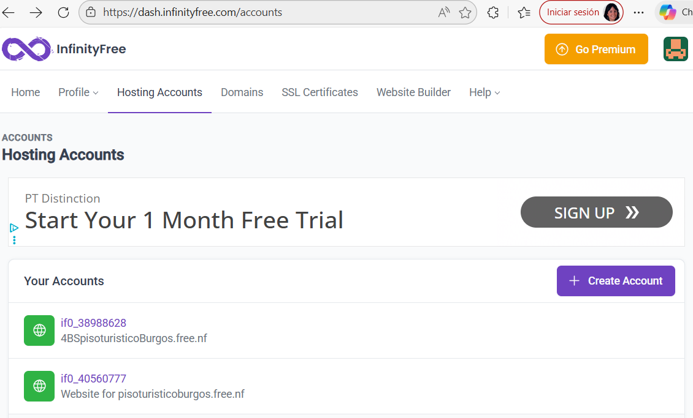

### 3.2. Elige un dominio  
Puede ser uno gratuito con subdominio *nombredetupiso* y extensión por ejemplo *lovestoblog.com* o un dominio propio si ya lo tienes.  
Comprueba la disponibilidad en *Check Availability*.  
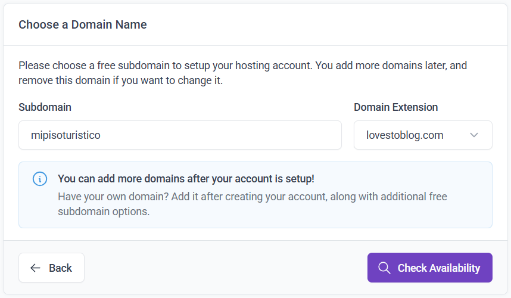  
Y crea la cuenta en *Create Account*.  
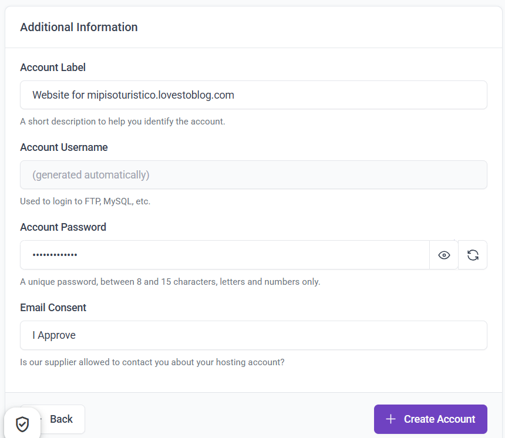 

### 3.3. Espera a que *InfinityFree* active la cuenta (1–2 minutos).
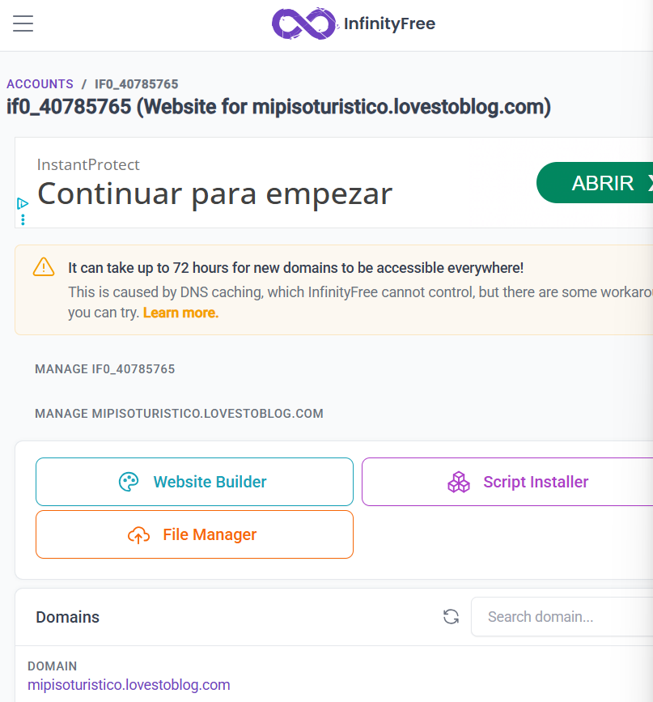 

### 3.4. Entra en la cuenta creada.
- **Puedes ver la *URL* del sitio y los datos *FTP* en *Overview*.**  
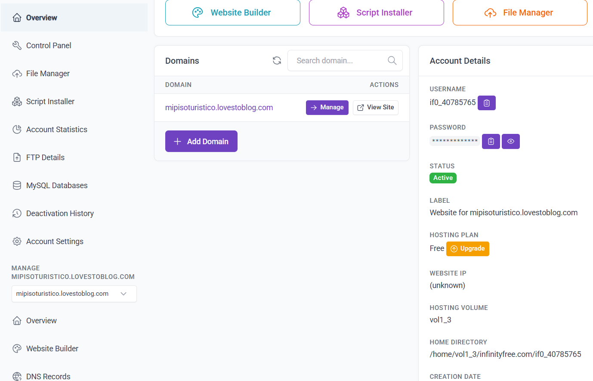 
- **Puedes acceder al panel de control en *Control Panel*.**  
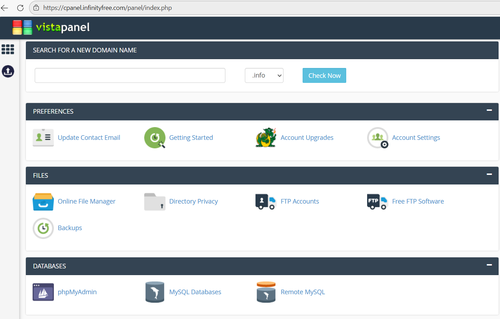

## 4. Crea la base de datos MySQL

### 4.1. Accede a *Control Panel*.  


### 4.2. Accede a *DataBases -> MySQL Databases*.  
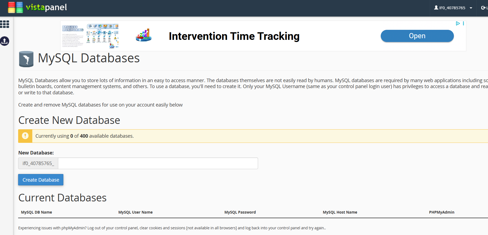

### 4.3. Crea la base de datos bd_pisoturistico.
Es muy importante que se llame **bd_pisoturistico**.  
Escribe el nombre pulsa en *Create Database*.  
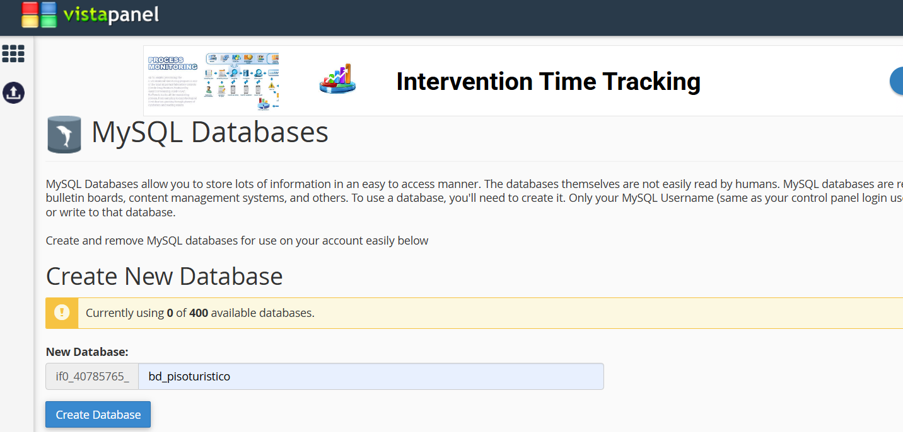

## 5. Crea una cuenta en *Stripe* para gestionar los pagos

### 5.1 Crea un entorno de trabajo.

### 5.2 Accede a las claves de API de ese entorno. Necesitarás copias las dos claves:
- Clave publicable: pk_testxxxxxxxxxxxxxxxxxxx
- Clave secreta: sk_testxxxxxxxxxxxxxxxxxxxxxxxxx

### 5.3 Crea un *webhook* para gestionar los pagos. Necesitarás añadir un destino para los eventos de *Stripe*. Dicho destino debe tener seleccionados los siguientes eventos como mínimo:
- *checkout.session.completed*
- *payment_intent.succeeded*
- *charge.succeeded*
- *charge.refunded*

### 5.4 Copia la clave de *webhook*.

## 6. Configuración *config.php*
El proyecto incluye un archivo de configuración de datos sensibles con los que trabaja el servidor.  
Este archivo se encuentra en *private/config.php* dentro del proyecto.  
**Qué debes modificar:**
1. Datos del propietario. Estos datos se utilizan para el envío de correos automáticos desde el formulario de contacto y desde el sistema de reservas.
- $propietarioPassword: contraseña o clave de aplicación del correo (Gmail App Password).

2. Conexión a la base de datos. Estos valores deben coincidir con los datos proporcionados por el servicio de *hosting* y se encuentran en *FTP Details* de la cuenta de *InfinityFree*.
- $db_host: servidor MySQL.
- $db_user: usuario de la base de datos.
- $db_pass: contraseña del usuario.
- $db_name: nombre de la base de datos.  
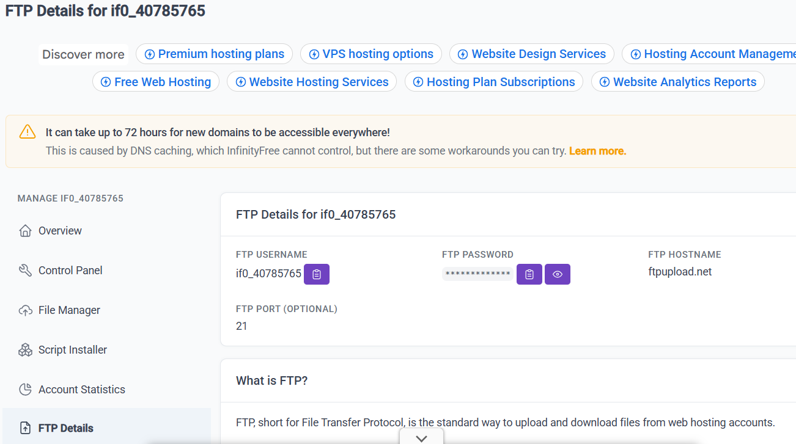

3. Claves de *Stripe* del apartado punto anterior.
 
## 7. Descarga la librería externa *stripe-php*.
Se puede descargar del siguiente enlace: 
https://github.com/stripe/stripe-php.git

## 8. Preparar el proyecto (npm)
Antes de ejecutar la aplicación en tu entorno local, es necesario instalar las dependencias y generar la versión compilada del proyecto.   
Para ello, abre una terminal en la carpeta raíz del proyecto y comprueba si tienes instalado Node.js con el comando:  
```node -v```  
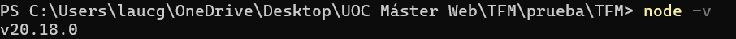  
Si no tienes descargado Node.js debes descargarlo desde la web oficial: https://nodejs.org.  
A continuación, ejecuta los siguientes comandos:  
```npm install```  
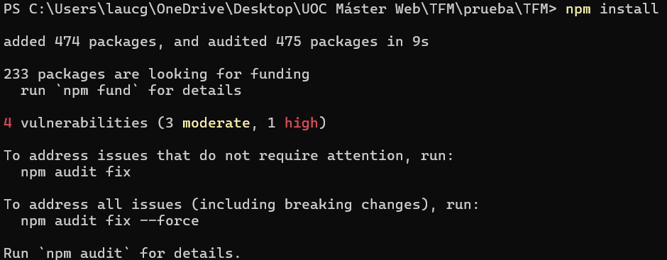  
```npm install leo-profanity```  
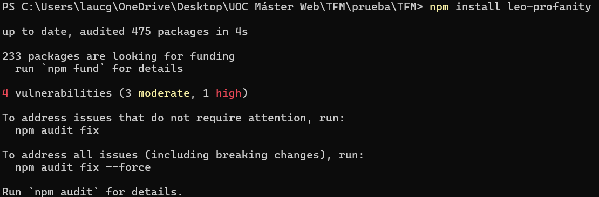  
```npm run build```  
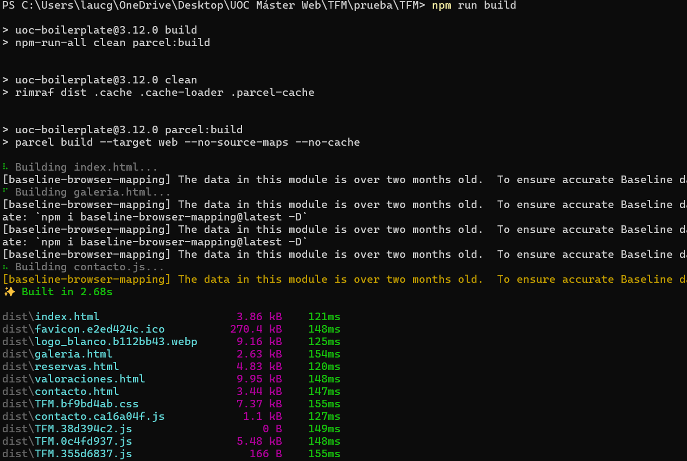  
Al finalizar habrá creado la carpeta *dist* con el contenido de la página web listo para producción:  
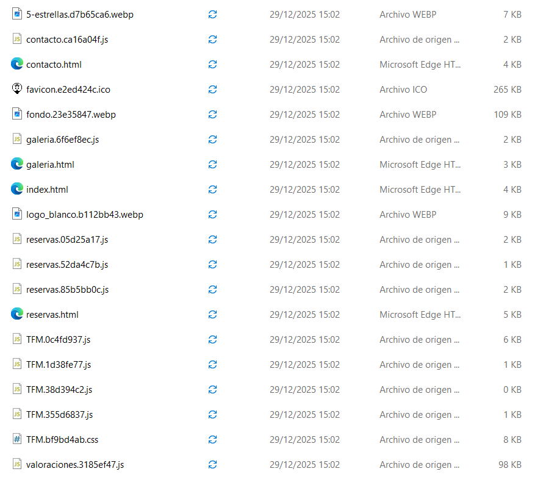

## 9. Sube la carpeta *dist* al servidor 

### 9.1. Accede a *File Manager*  
En el panel de control de InfinityFree, entra en File Manager para gestionar los archivos del servidor.  
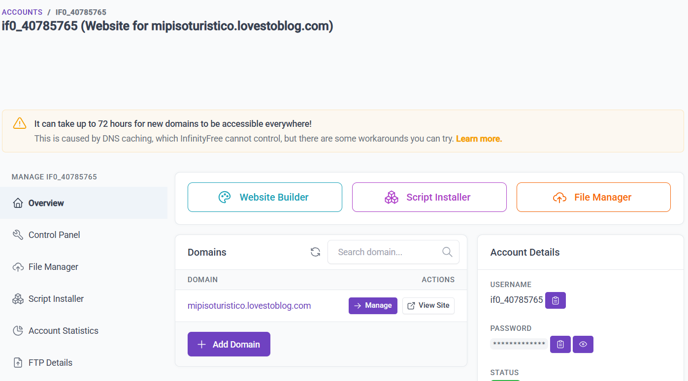

### 9.2. Sube el contenido de *dist*
Dentro del administrador de archivos, abre la carpeta *htdocs*. A continuación:
- Elimina los archivos que vienen por defecto en *htdocs*.
- Haz clic en *Upload*.
- Selecciona *Files*.
- Elige todos los archivos y carpetas que contiene tu carpeta *dist*.
- Sube el contenido para reemplazar el sitio por tu versión compilada.  
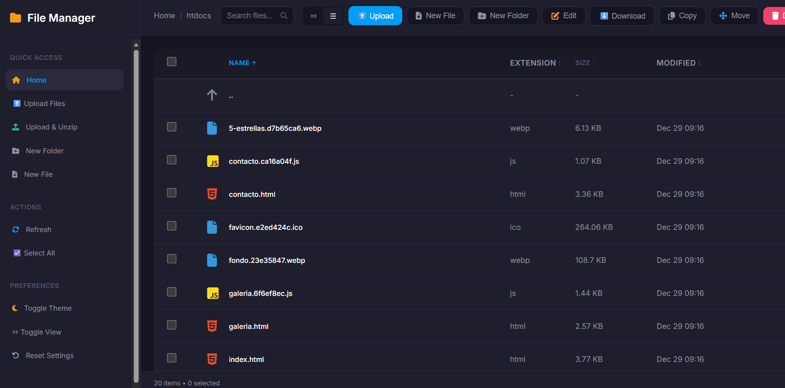

## 10. Agrega las fotografías de tu vivienda a la carpeta *assets/images/galeria*.
También puedes agregar una imagen de fondo de tu localidad o zona que se mostrará en la página de inicio, subiéndola a *assets/images*.

## 11. Sube la carpeta *stripe-php* dentro de la carpeta *private*. 
Además del contenido de la carpeta *dist*, es necesario subir *stripe* al servidor.

## 12. Ejecuta el *script* de instalación para crear las tablas de tu base de datos. 
Dicho *script* se encuentra accediendo a tu dominio seguido de *install/init.php*

## 13. Finaliza todos los pasos de la instalación y accede al panel de admin con el dominio de tu web seguido de */php/admin/login.php*
Desde el panel de administrador se pueden modificar los datos de toda la web, así como ver las reservas, cancelaciones y valoraciones.
También se pueden devolver los reembolsos de las cancelaciones y permite al administrador modificar su contraseña o recuperarla en caso de olvido.

## 14. Comprobación final
Enhorabuena, ya tienes todo listo.  
Para comprobarlo abre tu dominio en el navegador y verifica el correcto funcionamiento:  
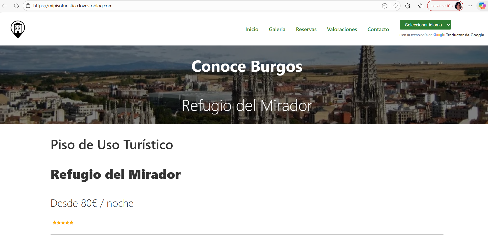


